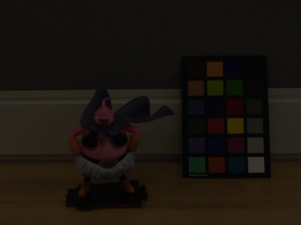
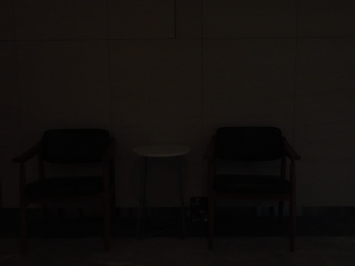
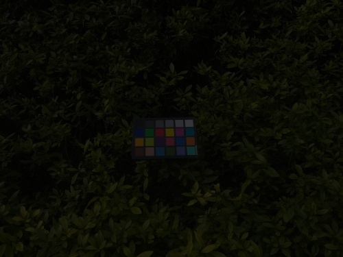

# LLGS: Illuminating Gaussian Splatting via absorptance Modulation

# Demo gif
|  |  |  |
| :--------------------------------------| :--------------------------------------| :--------------------------------------|
|  |  |  |

# Real-world Low Light Scene
We present a demonstration of the training effects on some real-world dark scenes.

| |
| :--------------------------------------|
| |
| |

